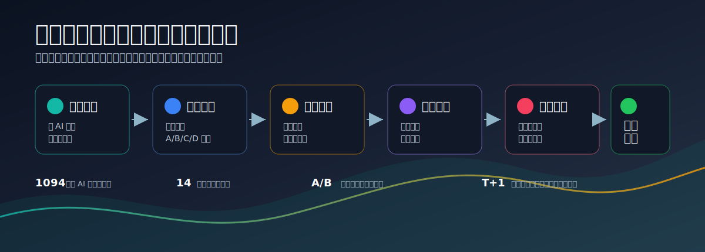

# Douyin Stocks Knowledge Base

> 将抖音短线交易教学、游资复盘和盘面语言，转译为可搜索、可验证、可回测的 A 股量化策略研究线索。



## 项目定位

`douyin_stocks` 不是一个普通的炒股笔记仓库，也不是直接给交易信号的策略库。它的目标是把短视频里的经验表达，例如“承接强”“题材主线”“分歧修复”“竞价抢筹”“主升浪”，拆解成 Codex 可以继续研究的结构化对象：

- 可观测变量
- 数据字段
- 搜索关键词
- 策略假设
- 反证问题
- 回测质量门禁

项目当前聚焦 A 股短线和题材交易研究，尤其关注集合竞价、开盘行为、涨停后路径、题材强度、短线情绪、首板溢价、尾盘隔夜、龙虎榜席位和主升启动等方向。

## 为什么需要这个项目

短视频里的交易内容有两个常见问题：

1. 信息密度不稳定，容易混入营销话术、盘后归因和不可复现判断。
2. 很多有价值的盘感没有被翻译成数据字段，因此无法搜索论文、开源代码或做回测。

本项目的处理原则是：保留原始材料，但不直接相信原始结论。所有经验话术都必须先转成可观察、可复现、可反证的研究问题，再进入量化实验。

## 当前素材规模

截至 2026-07-02，知识库已经完成第一轮结构化处理：

| 模块 | 状态 |
| --- | --- |
| 问 AI 原始素材 | 1094 条已完成机器评分 |
| 高价值素材 | A 级 24 条，B 级主题合并 106 条 |
| 因子假设 | 14 个主题方向 |
| 策略搜索任务 | 多作者、多主题任务卡持续更新 |
| 反证机制 | 已建立策略假设反证队列和回测质量门禁 |

部分已处理作者和主题包括：机油手、股市不倒翁、湖滨四季/作手新一/木果、炒股养家、主升龙头真经等。原始素材只作为证据池，长期知识层优先保留方法论、变量映射和实验设计。

## 工作流

项目采用“原文优先、提炼克制、反证先行”的流程：

1. **采集原文**：通过抖音网页版问 AI 获取视频摘要、对白或结构化回答。
2. **清洗隔离**：识别错采、串作者、营销噪声和低价值内容。
3. **机器评分**：按交易主题、字段密度、可回测程度和噪声程度进行分级。
4. **方法提炼**：把盘面话术转成变量、假设、失效条件和研究关键词。
5. **反证入队**：每个策略假设必须进入反证队列，避免把经验结论写死。
6. **回测门禁**：检查 T+1、涨跌停、停牌、滑点、容量、偷看未来等 A 股约束。

## 知识库结构

```text
00_收件箱/              原始问 AI 素材和待处理内容
10_目标与SOP/           采集、提炼、策略搜索和质量控制 SOP
20_市场机制/            A 股机制、盘面语言和数据字段映射
30_量化因子假设/        可回测因子和策略假设
40_策略搜索任务/        作者与主题维度的研究任务卡
50_实验验证/            反证队列和回测质量门禁
90_索引/                首页、方法论地图和阅读入口
scripts/                采集、同步、评分和日常处理脚本
src/douyin_kb/           抖音采集与知识库处理代码
```

核心入口：

- [知识库首页](90_索引/首页.md)
- [Codex 量化策略搜索 SOP](10_目标与SOP/Codex量化策略搜索SOP.md)
- [盘面语言到数据字段映射](20_市场机制/盘面语言到数据字段映射.md)
- [优先搜索队列](40_策略搜索任务/优先搜索队列.md)
- [全作者策略方法论地图](90_索引/全作者策略方法论地图.md)
- [策略假设反证队列](50_实验验证/策略假设反证队列.md)
- [A 股策略回测质量门禁](50_实验验证/A股策略回测质量门禁.md)

## 研究主题

当前沉淀的因子假设主要包括：

- 集合竞价与开盘行为
- 量比、换手与成交活跃度
- 盘口订单流与委比
- K 线、均线、支撑压力
- 题材强度与龙头扩散
- 首板溢价与低风险复利
- 主升启动与涨停前兆
- 涨停后次日分时路径
- 尾盘强度与隔夜溢价
- 产业催化与涨价预期差
- 龙虎榜席位与市场记忆
- 监管异动与高位约束
- 分歧修复与风格切换
- 短线风控与仓位状态

这些主题不会被直接写成“有效策略”。每个主题都需要进一步回答：需要什么数据粒度、是否可执行、是否偷看未来、交易成本是否吞噬收益、样本外是否稳定。

## 使用方式

### 1. 阅读知识库

建议从 [90_索引/首页.md](90_索引/首页.md) 开始。Obsidian 用户可以直接打开整个仓库作为 vault；GitHub 用户也可以按目录阅读 Markdown 文件。

### 2. 更新素材评分

```powershell
python scripts\score_douyin_materials.py
```

该脚本会更新：

- `40_策略搜索任务/问AI素材评分表.csv`
- `40_策略搜索任务/问AI高价值素材优先队列.md`

### 3. 继续采集和提炼

采集脚本主要位于 `scripts/`，核心处理代码位于 `src/douyin_kb/`。由于抖音网页、验证码、账号状态和问 AI 面板会变化，采集环节仍然需要人工监督，不建议完全无人值守。

## 质量原则

本项目刻意避免以下做法：

- 把“主力意图”“骗线”“控盘”直接当事实。
- 把视频作者的私有指标名直接写成策略因子。
- 只根据单条视频生成长期方法论。
- 忽略 A 股 T+1、涨跌停、停牌和容量约束。
- 只做胜率叙事，不做反证和样本外检查。

保留下来的内容必须能服务下一步研究：搜索论文、找开源实现、定义数据字段、设计事件研究或构造回测。

## 风险声明

本仓库仅用于投资研究、知识管理和量化策略假设整理，不构成任何投资建议。短线交易具有高风险，所有策略假设都需要在可靠数据、严格回测和真实交易约束下独立验证。

